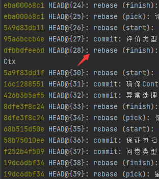
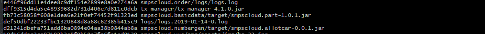

# GIT

# `git push -f`

- 意外merge其他分支
- 意外rebase其他分支
- 意外在其他分支提交代码
- `...`

总之不是正常情况下`commit & push`了,这时候就有机会用上这个尤为需要慎重使用的参数 `-f`

### 下面来操作步骤

1. `git reflog` 查看最近的操作

2. 找到误操作的哪一个记录，执行 `git reset --hard`

例如：回退到上图红色箭头的rebase之前`git reset --hard HEAD@{28}`
> 此操作后，在此之后执行的操作都将会被忽略掉
> 如果有需要保存的变更，请自行留存
> 操作完成后，自行copy留存进行相应`add & commit`操作

3.确认无误后，就可以执行最为关键操作覆盖远端记录`git push -f`

# filter-branch 改写已存在的历史记录

如果有时候不小心添加了一些敏感信息/二进制文件/日志文件等文件到git中,这时候就需要改写这一部分的历史记录

- 大文件
    - 查询大文件

  `git rev-list --objects --all | grep "$(git verify-pack -v .git/objects/pack/*.idx | sort -k 3 -n | tail -15 | awk '{print$1}')"`

  

  - 删除文件及相关记录

  `git filter-branch --tree-filter 'rm -f path/to/large/files' --tag-name-filter cat -- --all`
  例如删除上图中的 `smpscloud.basicdata/target/smpscloud.part-1.0.1.jar`文件
  `git filter-branch --tree-filter 'rm -f smpscloud.basicdata/target/smpscloud.part-1.0.1.jar' --tag-name-filter cat -- --all`
  > path/to/large/files 是指定文件的路径
  > 这里一定要小心,这是不可逆的，文件路径一定要写正确

- 指定文件

参考`大文件`>`删除文件及相关记录`