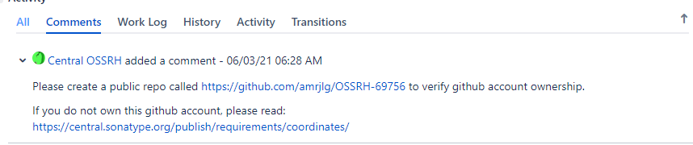

# Sonatype Nexus

**[官网文档](https://central.sonatype.org/publish/publish-guide/)**

## Sonatype 账号及Group Id

1. 在[Sonatype Nexus官网](https://issues.sonatype.org/)创建自己的账号

2. 新建 Issue ，选择***New Project***

3. 填写***Group Id***，***Project URL***

4. 在***Already Synced to Central***选择***no***。因为是新项目,之前在maven仓库肯定是没有的

5. 等一会儿后，会让你进行***Group Id***验证。例如使用github，会让你创建一个仓库确定账号所有权

   ​       

**验证完成后，Sonatype 的准备工作告一段落**

## GPG证书准备

6. 在 Windows 下，我们下载安装一个 Kleopatra。这个没什么好说的，一路下一步安装完事

7. 创建证书

   新建秘钥对 -> Open GPG -> 填写名称、邮件(名称不能是中文，可选使用密码保护) -> 输入密码 -> 创建完成

8. 将秘钥发布到服务器

   这里可以选择将服务器发布到哪个证书托管服务器，除开工具默认的还有以下服务器可用

   - keyserver.ubuntu.com
   - keys.openpgp.org
   - pgp.mit.edu

9. 导出证书，以备上传时签名使用

10. 查看GPG key 如下 key为 93BFCA02

    ```shell
    gpg --list-signatures --keyid-format 0xshort
    ------------------------------------------------
    pub   rsa3072/0x93BFCA02 2021-06-04 [SC] [expires: 2023-06-04]
          3B4D9F0BAC884AB7DA3EC94E83237F4493BFCA02
    uid           [ultimate] amrjlg <2899297045@qq.com>
    sig 3        0x93BFCA02 2021-06-04  amrjlg <2899297045@qq.com>
    sub   rsa3072/0xFB249135 2021-06-04 [E] [expires: 2023-06-04]
    sig          0x93BFCA02 2021-06-04  amrjlg <2899297045@qq.com>
    ```

    

## Gradle 配置
配置编码 、javadoc
```groovy
tasks.withType(JavaCompile) {
    options.encoding = "UTF-8"
}
// for more information https://docs.gradle.org/current/javadoc/org/gradle/external/javadoc/StandardJavadocDocletOptions.html
tasks.withType(Javadoc) {
    options {
        encoding "UTF-8"
        charSet "UTF-8"
        author true
        version true
        // 需要https才能生效
        links "https://docs.oracle.com/javase/8/docs/api"
        title "common"
    }

}
```

配置基本插件

```groovy
apply plugin: 'maven'
apply plugin: 'signing'
```

打包源码、文档

```groovy
task javadocJar(type: Jar) {
    classifier = 'javadoc'
    from javadoc
}

task sourcesJar(type: Jar) {
    classifier = 'sources'
    from sourceSets.main.allSource
}
```

配置包文件

```groovy
artifacts {
    archives javadocJar, sourcesJar
}
```

定义签名的文件

```groovy
signing {
    sign configurations.archives
}
```

配置包基本信息

```groovy
// group id 这跟上面验证的需要一致，不然会没有权限
group 'io.github.amrjlg'
// 这是包的名称，在中央仓库的包名
archivesBaseName = "commons"
// 发布版本
version '1.2-RELEASE'
```

配置上传任务

```groovy
uploadArchives {
    repositories {
        mavenDeployer {
            beforeDeployment { MavenDeployment deployment -> signing.signPom(deployment) }
            // 配置上传仓库地址 已经认证信息 配置文件是gradle根目录的gradle.properties或者是
            // GRADLE_USER_HOME/gradle.properties 具体参考gradle
            repository(url: "https://s01.oss.sonatype.org/service/local/staging/deploy/maven2/") {
                authentication(userName: "${ossrhUsername}", password: "${ossrhPassword}")
            }

            snapshotRepository(url: "https://s01.oss.sonatype.org/content/repositories/snapshots/") {
                authentication(userName: "${ossrhUsername}", password: "${ossrhPassword}")
            }

            pom.project {
                name 'common utils.'
                packaging 'jar'
                // optionally artifactId can be defined here
                description 'common utils.'
                url 'https://github.com/amrjlg/common'
                // scm 信息 必须
                scm {
                    connection 'https://github.com/amrjlg/common.git'
                    developerConnection 'https://github.com/amrjlg/common.git'
                    url 'https://github.com/amrjlg/common'
                }
                // 开源协议 可选
                licenses {
                    license {
                        name 'The Apache License, Version 2.0'
                        url 'https://www.apache.org/licenses/LICENSE-2.0.txt'
                    }
                }
                // 开发者信息 必须
                developers {
                    developer {
                        id 'amrjlg'
                        name 'amrjlg'
                        email '2899297045@qq.com'
                    }
                }
            }
        }
    }
}
```

gradle.properties

```properties
# 制定使用哪个证书
# 导出文件名称默认为 amrjlg_0x93BFCA02_SECRET.gpg
# 文件key 就是 93BFCA02
signing.keyId=93BFCA02
# 证书密码
signing.password=0231625530
# 证书路径 使用绝对路径
signing.secretKeyRingFile=D:/program/gradle/6.8.3/amrjlg_0x93BFCA02_SECRET.gpg
# 这里是上传仓库的认证信息 推进使用 user token的配置
ossrhUsername=
#
ossrhPassword=
```

