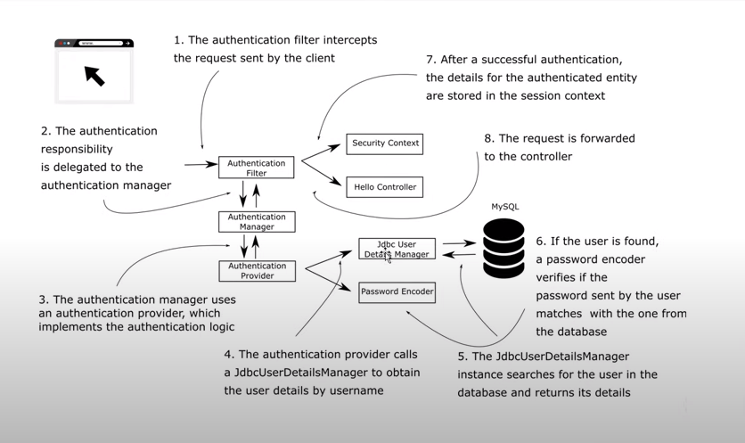

# Spring Security

## 1. Architecture

    
- `AuthenticationFilter`

  1. 通过`RequestMatcher#matches(HttpServletRequest)`判断是否需要执行后续检验

  2. 通过`AuthenticationConverter#convert(HttpServletRequest)`获取`Authentication`

     如果未获取到`Authentication`则直接放行

  3. 通过`AuthenticationManagerResolver<HttpServletRequest>#resolve(HttpServletRequest)`方法获取`AuthenticationManager`

  4. 通过`AuthenticationManager#authenticate(Authentication)`判断是否登录

- `AuthenticationManager`

  通过此方法`AuthenticationManager#authenticate(Authentication)`确定是否登录

- `AuthenticationProvider`

  

  该类

- `PasswordEncoder`

  

- `UserDetailService`

  

- 

## 2. 
## 3. 
## 4. 
## 5. 